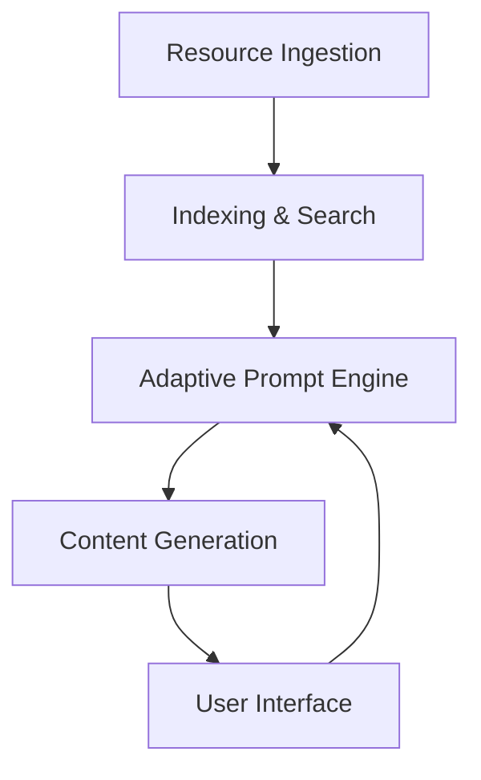

# Product Requirements Document (PRD): Adaptive Learning System

---

## 1. Purpose

Develop an adaptive learning system that indexes and dynamically generates educational content based on user knowledge
gaps, leveraging a diverse dataset (texts, PDFs, videos, images). The system aims to provide a personalized,
interactive, and format-flexible learning experience for programming fundamentals.

---

## 2. Problem Statement

Traditional educational platforms deliver static content, making it difficult to identify and remediate individual
knowledge gaps. Learners struggle to efficiently find relevant resources across multiple formats, and current systems
lack dynamic, user-tailored content generation.

---

## 3. Goals & Objectives

- Efficiently index and retrieve educational resources in text, PDF, video, and image formats.
- Assess user knowledge gaps through interactive dialogue.
- Generate concise, dynamic content in the user’s preferred format (text, video, audio).
- Adapt to user learning preferences and provide continuous feedback.
- Ensure all processing is local and privacy-respecting.
- Maintain a modular, extensible, and well-documented codebase.

---

## 4. User Stories

- **As a learner**, I want to interact with a conversational interface that identifies my knowledge gaps, so I can focus
  on what I need to learn.
- **As a learner**, I want to receive content in my preferred format (text, video, audio), so my learning experience
  matches my style.
- **As a learner**, I want the system to adapt to my progress and feedback, so the content remains relevant and
  effective.
- **As a developer**, I want the system to be modular and extensible, so new resource types and learning strategies can
  be added easily.
- **As a reviewer**, I want clear documentation of architecture, libraries, and decisions, so I can evaluate the
  system’s quality and maintainability.

---

## 5. Functional Requirements

### 5.1 Data Ingestion & Indexing

- Ingest and parse all provided resources:
  - Text: .txt, .json
  - PDF: Books, manuals (using OCR or PDF parsers)
  - Video: Transcribe audio, extract metadata
  - Image: Extract metadata and tags
- Index all resources for both keyword and semantic search.
- Support efficient retrieval by type, topic, and relevance.

### 5.2 Adaptive Prompt Engine

- Interactive dialogue system to assess user knowledge and preferences.
- Identify knowledge gaps and preferred learning styles.
- Generate dynamic, short-form content in multiple formats.

### 5.3 Content Generation

- Use indexed data to create personalized learning content.
- Adapt content format and complexity to user needs.

### 5.4 User Interface

- Intuitive, conversational interface for knowledge assessment.
- Seamless adaptation to user learning preferences.
- Delivery of concise, relevant, and level-appropriate content.
- Continuous feedback and adaptation based on user interactions.

### 5.5 Documentation

- Maintain up-to-date documentation (including COMMENTS.md) covering:
  - Architecture
  - Libraries and dependencies
  - Design decisions
  - Improvements and unmet requirements

---

## 6. Non-Functional Requirements

- All data processing must be local (no external data sharing).
- Codebase must be modular, extensible, and maintainable.
- Efficient handling of large and diverse datasets.
- Use only open-source, compatible dependencies.
- High code quality with clear documentation and comments.
- **Active Enforcement**: Emphasis on local processing and privacy-respecting practices, ensuring that all dependencies
  align with open-source standards, and integrating continuous feedback and adaptation as a core part of the development
  workflow.

---

## 7. System Architecture

### 7.1 High-Level Overview

### 7.2 Key Components

- **Data Ingestion**: Adapters for each resource type (pipeline pattern).
- **Indexing & Search**: Keyword and semantic search (Elasticsearch [Python client], Pinecone [Python client], other
  Python-based vector DBs).
- **Prompt Engine**: Dialogue system (LangChain, LlamaIndex, OpenAI API [Python integration]).
- **Content Generation**: Dynamic, format-adaptive content creation.
- **User Interface**: Conversational, adaptive, and feedback-driven.

### 7.3 Design Patterns

- Pipeline Pattern (data ingestion)
- Adapter Pattern (resource type handling)
- Strategy Pattern (content generation/adaptation)
- Factory Pattern (prompt/content modules)
- Separation of Concerns (all components)

---

## 8. Technology Stack

- **Python 3.8+**
- Text/PDF: PyPDF2, pdfminer.six, nltk, spaCy (used for enhanced NLP in knowledge gap assessment)
- Video: Vosk (Python, using 'vosk-model-small-pt-0.3' for Brazilian Portuguese content, confirmed operational for local
  transcription)
- Image: Pillow, exifread
- Search: Elasticsearch (Python client), Pinecone (Python client), FAISS, other Python-based vector DBs (for potential
  semantic search enhancements)
- Prompt Engine: Custom implementation with spaCy for NLP-based topic classification, fallback content retrieval
  mechanisms
- Web UI: FastAPI (backend), React (frontend for conversational interface)
- Containerization for isolation (Docker)
- Dependency management via requirements.txt or poetry

---

## 9. Milestones & Timeline

1. **Project Setup & Documentation** (Complete)
2. **Data Ingestion & Indexing Modules** (Text, PDF, Video, Image) - Completed, with video transcription fully
   operational using 'vosk-model-small-pt-0.3' for Brazilian Portuguese content
3. **Adaptive Prompt Engine Prototype** - Completed, enhanced with spaCy for NLP-based knowledge gap assessment and
   improved content retrieval mechanisms
4. **Content Generation Module** - Partially complete, with basic content adaptation in place; advanced NLP integration
   pending
5. **User Interface Implementation** - Partially complete, basic web UI implemented using FastAPI and React, integrated
   with Prompt Engine; usability refinements pending
6. **Integration & Testing** - Partially complete, integration tests added for API endpoint; further end-to-end testing
   for UI and content accuracy needed
7. **Documentation Finalization** - Partially complete, updated COMMENTS.md and Memory Bank files; final refinements
   pending
8. **Repository Management & Delivery** - Pending, to be completed as per project instructions for forking, pushing, and
   notifying recruiter

---

## 10. Success Criteria

- All resource types are correctly ingested, indexed, and retrievable.
- Adaptive prompt engine accurately identifies knowledge gaps and generates relevant content.
- User interface is intuitive and adapts to user preferences.
- All processing is local and privacy-respecting.
- Codebase is modular, extensible, and well-documented.
- All deliverables (including documentation) are complete and meet project requirements.

---

## 11. Risks & Mitigations

- **Complexity of resource extraction**: Use proven libraries and modular adapters.
- **Performance with large datasets**: Employ efficient indexing/search solutions.
- **User adaptation accuracy**: Iteratively test and refine prompt logic through continuous feedback and adaptation.
- **Documentation gaps**: Enforce documentation as a core part of the development workflow to ensure traceability to PRD
  success criteria and maintain up-to-date records of architecture, decisions, and improvements.

---

This PRD provides a comprehensive blueprint for building the adaptive learning system as described in the Memory Bank
and project documentation.
