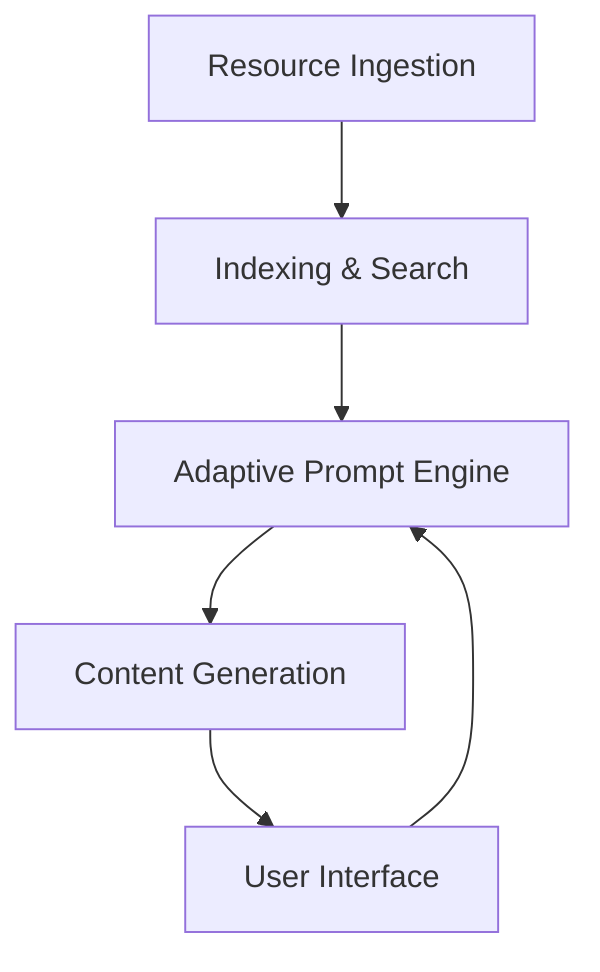

# System Patterns

## System Architecture

- **Data Ingestion**

  - Text: Direct parsing and indexing of .txt and .json files.
  - PDF: Text extraction using OCR or PDF parsers.
  - Video: Audio transcription (speech-to-text) and metadata extraction.
  - Image: Metadata and tag extraction.
  - Libraries/Tools: pdf-parse, natural, sharp, exiftool-vendored, OpenAI Whisper, Google Speech-to-Text API, Vosk

- **Indexing & Search**

  - All resources indexed for keyword and semantic search.
  - Support for efficient retrieval by type, topic, and relevance.
  - Libraries/Tools: ElasticSearch (Node.js client), Pinecone (Node.js client), other JavaScript-based vector DBs

- **Adaptive Prompt Engine**

  - Interactive dialogue system to assess user knowledge and preferences.
  - Identifies knowledge gaps and learning styles.
  - Generates dynamic, short-form content in multiple formats (text, video, audio).
  - Libraries/Tools: LangChain.js, LlamaIndex.js, OpenAI API (Node.js integration)

- **Content Generation**

  - Uses indexed data to create personalized learning content.
  - Adapts content format and complexity to user needs.

- **Modularity**

  - Clear separation of concerns: ingestion, indexing, retrieval, prompt logic, and content generation.
  - Extensible to support new resource types or learning strategies.

- **Documentation & Non-Functional Requirements**
  - Documentation is enforced as a critical system pattern and deliverable (including COMMENTS.md, architecture,
    libraries, improvements, unmet requirements).
  - All processing is local and privacy-respecting.
  - Only open-source, compatible dependencies are used.
  - Codebase is modular, extensible, and maintainable.
  - Containerization is used for isolation and reproducibility.
  - Continuous feedback and adaptation loop is integral to the system architecture.

## Design Patterns

- **Pipeline Pattern** for data ingestion and processing.
- **Adapter Pattern** for handling different resource types (text, PDF, video, image).
- **Strategy Pattern** for selecting content generation and adaptation strategies.
- **Factory Pattern** for prompt and content generation modules.
- **Separation of Concerns** throughout all components.
- **Documentation Enforcement** as a workflow pattern to ensure up-to-date, traceable documentation.

## Component Relationships

- Ingestion feeds into indexing.
- Indexing supports search and retrieval.
- Prompt engine interacts with user, queries index, and triggers content generation.
- Content generation delivers output to user interface.

## Critical Implementation Paths

- Accurate extraction and indexing of all resource types.
- Fast, relevant search and retrieval.
- Robust, adaptive prompt logic for user assessment and content delivery.

### Risks & Mitigations

- **Complexity of resource extraction:** Use proven libraries and modular adapters.
- **Performance with large datasets:** Employ efficient indexing/search solutions.
- **User adaptation accuracy:** Iteratively test and refine prompt logic.
- **Documentation gaps:** Enforce documentation as part of the development workflow and as a core system pattern.
